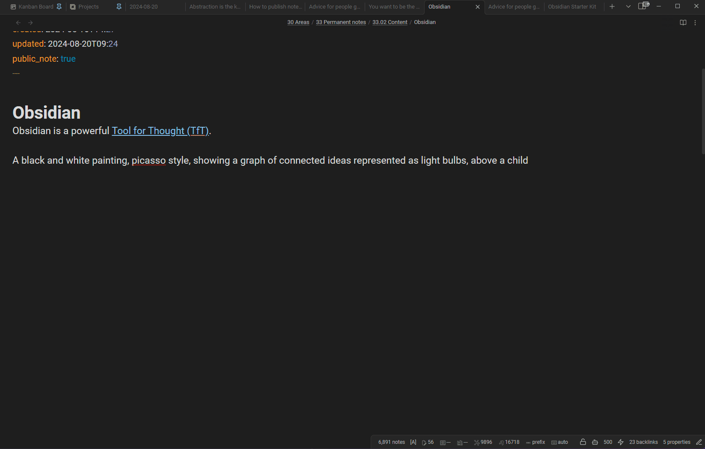

# Obsidian Replicate.com integration

Obsidian plugin that integrates [Replicate.com](https://replicate.com/) and enables using the various image generation models supported by Replicate (e.g., Stable Diffusion, FLUX.1, and many more) directly from your vault.

Demo:

## Features

- Generate images from the current selection or from a prompt entered in a modal.
- Configurable Replicate model (`<owner>/<name>` or `<owner>/<name>:<version>`).
- Free-form JSON input passed as `input` to the chosen model — works with any model that accepts a `prompt`.
- Optional: copy the generated output (URLs) to the clipboard.
- Optional: append the generated output as markdown image embeds to the current note.

> ⚠️ Images generated via Replicate are only stored on Replicate's servers **for one hour**. Download anything you want to keep.

## Prerequisites

- A [Replicate.com](https://replicate.com) account.
- A Replicate API token. Create one at [replicate.com/account/api-tokens](https://replicate.com/account/api-tokens).
- A configured billing method on Replicate if the model you want to use is paid.

## Installation

### Community plugins (recommended)

1. In Obsidian, go to **Settings → Community plugins**.
2. Disable **Restricted mode** if it's enabled.
3. Select **Browse**, search for **Replicate**, install it, then enable it.

You can also browse the catalog on the [Obsidian Community](https://community.obsidian.md/) website.

### Manual installation

If the plugin isn't listed in the community catalog yet (or you want a specific version):

1. Download `main.js`, `manifest.json`, and `styles.css` from the [latest release](https://github.com/dsebastien/obsidian-replicate/releases).
2. Copy them into `<Vault>/.obsidian/plugins/replicate/`.
3. Reload Obsidian and enable **Replicate** in **Settings → Community plugins**.

### BRAT (bleeding edge)

[BRAT](https://github.com/TfTHacker/obsidian42-brat) (Beta Reviewers Auto-update Tool) installs plugins straight from a GitHub repo and keeps them updated automatically. Use this if you want the latest commits — **things might break**.

1. Install **Obsidian42 - BRAT** from **Settings → Community plugins → Browse** and enable it.
2. Run **BRAT: Add a beta plugin for testing** from the command palette.
3. Paste `https://github.com/dsebastien/obsidian-replicate`.
4. Select the latest version and confirm.
5. Enable **Replicate** in **Settings → Community plugins**.

## Usage

Once the plugin is installed, enabled, and configured with your API key:

- **Command palette**: press `Ctrl/Cmd + P`, search for **Generate image(s) using Replicate.com**, and press `Enter`.
- **Context menu**: right-click inside a note and pick the same command.

Behaviour:

- If you have text selected, that selection is used as the prompt.
- If nothing is selected, a modal is shown so you can type a prompt.
- `Ctrl/Cmd + Enter` in the modal submits the prompt.

## Configuration

See [docs/configuration.md](docs/configuration.md) for the full reference.

Quick overview:

- **Replicate.com API Key** — your API token. Required.
- **Copy output to clipboard** — copies the generated URL(s) to the clipboard.
- **Append output to current note** — appends markdown image embeds to the active note.
- **Image generation model** — `<owner>/<name>` or `<owner>/<name>:<version>`.
- **Image generation model configuration** — JSON passed as the model's `input`. The prompt is merged in at call time.

## Tips and tricks

See [docs/tips.md](docs/tips.md) for common tips, troubleshooting, and pointers for picking model versions.

## Contributing

Contributions are welcome. See [CONTRIBUTING.md](CONTRIBUTING.md).

## License

[MIT](LICENSE).

## News & support

- Subscribe to [my newsletter](https://dsebastien.net) for updates on this plugin, Obsidian, Personal Knowledge Management, and note-taking. Paid subscribers make this work possible ❤️.
- Buy me a coffee: [buymeacoffee.com/dsebastien](https://www.buymeacoffee.com/dsebastien).
