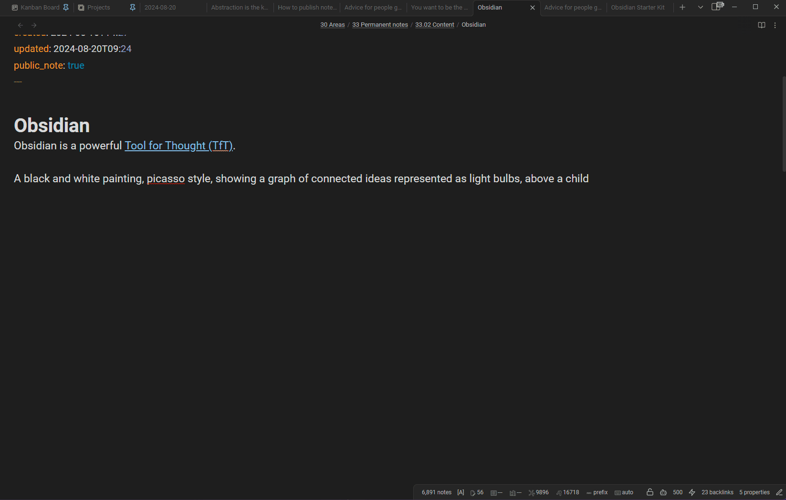

# Obsidian Replicate.com integration

Obsidian plugin that integrates [Replicate.com](https://replicate.com/) and enables using the various image generation models supported by Replicate (e.g., Stable Diffusion, FLUX.1, and many more) directly from your vault.

Demo:

## Features

- Generate images from the current selection or from a prompt entered in a modal.
- Configurable Replicate model (`<owner>/<name>` or `<owner>/<name>:<version>`).
- Free-form JSON input passed as `input` to the chosen model — works with any model that accepts a `prompt`.
- Optional: copy the generated output (URLs) to the clipboard.
- Optional: append the generated output as markdown image embeds to the current note.

> ⚠️ Images generated via Replicate are only stored on Replicate's servers **for one hour**. Download anything you want to keep.

## Prerequisites

- A [Replicate.com](https://replicate.com) account.
- A Replicate API token. Create one at [replicate.com/account/api-tokens](https://replicate.com/account/api-tokens).
- A configured billing method on Replicate if the model you want to use is paid.

## Installation

### Community plugins (recommended)

1. In Obsidian, go to **Settings → Community plugins**.
2. Disable **Restricted mode** if it's enabled.
3. Select **Browse**, search for **Replicate**, install it, then enable it.

You can also browse the catalog on the [Obsidian Community](https://community.obsidian.md/) website.

### Manual installation

If the plugin isn't listed in the community catalog yet (or you want a specific version):

1. Download `main.js`, `manifest.json`, and `styles.css` from the [latest release](https://github.com/dsebastien/obsidian-replicate/releases).
2. Copy them into `<Vault>/.obsidian/plugins/replicate/`.
3. Reload Obsidian and enable **Replicate** in **Settings → Community plugins**.

### BRAT (bleeding edge)

[BRAT](https://github.com/TfTHacker/obsidian42-brat) (Beta Reviewers Auto-update Tool) installs plugins straight from a GitHub repo and keeps them updated automatically. Use this if you want the latest commits — **things might break**.

1. Install **Obsidian42 - BRAT** from **Settings → Community plugins → Browse** and enable it.
2. Run **BRAT: Add a beta plugin for testing** from the command palette.
3. Paste `https://github.com/dsebastien/obsidian-replicate`.
4. Select the latest version and confirm.
5. Enable **Replicate** in **Settings → Community plugins**.

## Usage

Once the plugin is installed, enabled, and configured with your API key:

- **Command palette**: press `Ctrl/Cmd + P`, search for **Generate image(s) using Replicate.com**, and press `Enter`.
- **Context menu**: right-click inside a note and pick the same command.

Behaviour:

- If you have text selected, that selection is used as the prompt.
- If nothing is selected, a modal is shown so you can type a prompt.
- `Ctrl/Cmd + Enter` in the modal submits the prompt.

## Configuration

See [docs/configuration.md](docs/configuration.md) for the full reference.

Quick overview:

- **Replicate.com API Key** — your API token. Required.
- **Copy output to clipboard** — copies the generated URL(s) to the clipboard.
- **Append output to current note** — appends markdown image embeds to the active note.
- **Image generation model** — `<owner>/<name>` or `<owner>/<name>:<version>`.
- **Image generation model configuration** — JSON passed as the model's `input`. The prompt is merged in at call time.

## Privacy & data

- **Network**: the plugin only contacts [Replicate.com](https://replicate.com). Requests are sent solely when you trigger a generation (command, context menu, or modal submit). Your prompt and model configuration are sent to Replicate to generate images. There is no telemetry, no background polling, and no auto-update.
- **API key**: your Replicate API token is stored locally in the plugin's settings (your vault) and sent only to Replicate for authentication. It is never logged.
- **Clipboard**: when **Copy output to clipboard** is enabled, the plugin writes the generated image URL(s) to your system clipboard. It never reads the clipboard. Disable the setting if you do not want clipboard writes.
- **What's new after updates.** After a plugin update, a one-time dialog shows the release notes you just received (including skipped versions) with ways to support development. Never shown on fresh installs or regular restarts.

## Tips and tricks

See [docs/tips.md](docs/tips.md) for common tips, troubleshooting, and pointers for picking model versions.

## Contributing

Contributions are welcome. See [CONTRIBUTING.md](CONTRIBUTING.md).

## License

[MIT](LICENSE).

<!-- other-plugins:start -->

## My other Obsidian plugins

| Plugin                                                                                                        | What it does                                                                                                                                  |
| ------------------------------------------------------------------------------------------------------------- | --------------------------------------------------------------------------------------------------------------------------------------------- |
| [Agentic Resource Discovery Server](https://github.com/dsebastien/obsidian-agentic-resource-discovery-server) | Local-first Agentic Resource Discovery publisher and registry that serves your AI skills and tools to agents over a local HTTP and MCP server |
| [Book Exporter](https://github.com/dsebastien/obsidian-book-exporter)                                         | Export books (one manifest note + linked chapter notes) to EPUB and PDF via Pandoc                                                            |
| [Bookshelf Base](https://github.com/dsebastien/obsidian-bookshelf)                                            | Display your notes as a visual bookshelf via a custom Bases view                                                                              |
| [Dataview Serializer](https://github.com/dsebastien/obsidian-dataview-serializer)                             | Serialize Dataview queries to Markdown, and keep the Markdown representation up to date                                                       |
| [Expander](https://github.com/dsebastien/obsidian-expander)                                                   | Replace variables across your vault using HTML comment markers. Supports static values and dynamic functions                                  |
| [Ghost Publish](https://github.com/dsebastien/obsidian-ghost-publish)                                         | Publish your vault notes to a Ghost blog with configurable presets for tags, newsletters, and frontmatter conventions                         |
| [Graph Explorer Base View](https://github.com/dsebastien/obsidian-graph-explorer-base-view)                   | A custom Bases view that renders notes as an interactive force-directed graph with explored/unexplored tracking                               |
| [Hidden Folders Access](https://github.com/dsebastien/obsidian-hidden-folders-access)                         | Index hidden root-level folders (e.g. .claude) so they appear in the file tree, metadata cache, and Bases                                     |
| [Journal Bases](https://github.com/dsebastien/obsidian-journal-base)                                          | Custom Base views for journaling and periodic reviews                                                                                         |
| [Kanban Action Planner](https://github.com/dsebastien/obsidian-kanban-action-planner)                         | Render your notes as configurable Kanban boards and calendars inside Bases, with statuses, ordering, relationships, and scheduling            |
| [Life Tracker](https://github.com/dsebastien/obsidian-life-tracker-base-view)                                 | Capture and visualize the data that matters in your life                                                                                      |
| [Note Village](https://github.com/dsebastien/obsidian-note-village)                                           | A 2D pixel art village where your notes become villagers you can explore and chat with using AI                                               |
| [Obsidian Starter Kit](https://github.com/DeveloPassion/obsidian-starter-kit-plugin)                          | Adds strong typing support and powerful automation support for notes                                                                          |
| [Remarkable Synchronizer](https://github.com/dsebastien/obsidian-remarkable-sync)                             | Connect to the reMarkable cloud, list, download, and sync notebook pages as images                                                            |
| [REST and MCP server](https://github.com/dsebastien/obsidian-cli-rest)                                        | Exposes CLI commands as RESTful API endpoints and an MCP server for AI tool integration                                                       |
| [Time Machine](https://github.com/dsebastien/obsidian-time-machine)                                           | Browse, compare, and restore previous versions of your notes using built-in file-recovery snapshots                                           |
| [Transcriber](https://github.com/dsebastien/obsidian-transcriber)                                             | Transcribe images to markdown using Ollama vision models                                                                                      |
| [Typefully](https://github.com/dsebastien/obsidian-typefully)                                                 | Publish social media posts with ease using the Typefully integration                                                                          |
| [Update Time](https://github.com/dsebastien/obsidian-update-time)                                             | Automatically update front matter to include creation and last update times                                                                   |

Everything I build is documented in [my newsletter](https://dsebastien.net/newsletter) and on [my YouTube channel](https://youtube.com/@dsebastien).

<!-- other-plugins:end -->

<!-- support-cta -->

## News & support

To stay up to date about this plugin, Obsidian in general, Personal Knowledge Management and note-taking:

- Subscribe to [my newsletter](https://dsebastien.net/newsletter)
- Subscribe to [my YouTube channel](https://youtube.com/@dsebastien)
- Join the [Knowii community](https://www.store.dsebastien.net/product/knowii-community/) and learn to organize your notes and put your knowledge to work, together with fellow knowledge workers

If this plugin is useful to you, here are the best ways to support my work ❤️:

- [Join the Knowii community](https://www.store.dsebastien.net/product/knowii-community/)
- [Become a GitHub Sponsor](https://github.com/sponsors/dsebastien)
- [Buy me a coffee](https://www.buymeacoffee.com/dsebastien)
- [Subscribe to my YouTube channel](https://youtube.com/@dsebastien)
- [Check out my products](https://store.dsebastien.net)

Found a bug or have an idea? [Open an issue](https://github.com/dsebastien/obsidian-replicate/issues).
